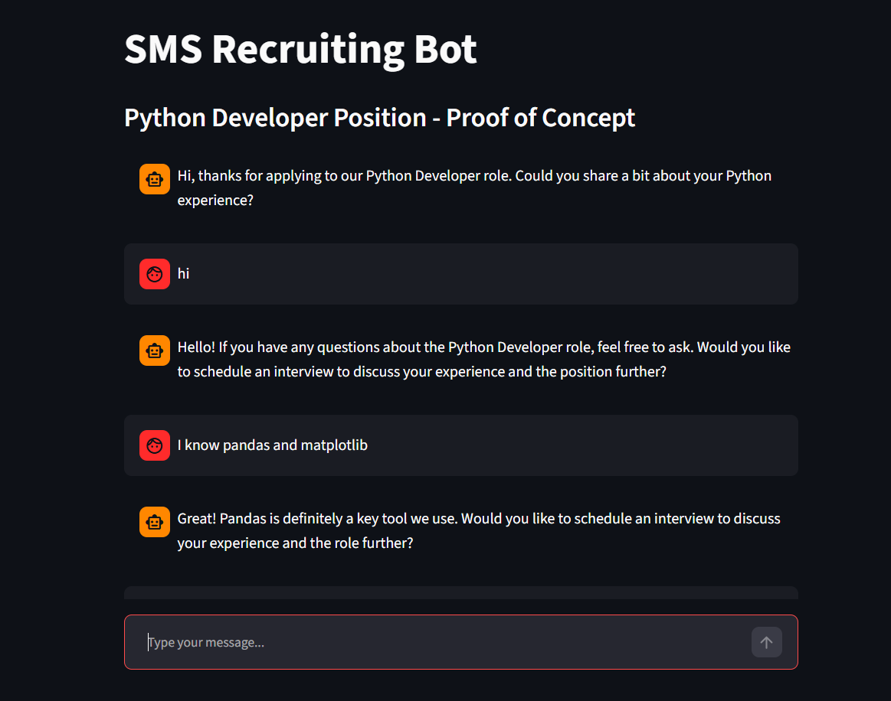

<!-- PROJECT LOGO -->
<p align="center">
  
</p>

<h1 align="center">SMS Recruiting Chatbot</h1>

<p align="center">
  A GenAI multi-agent chatbot that interviews Python Developer candidates over SMS<br>
  <a href="#usage">View Demo</a>
  ·
  <a href="#usage">Report Bug</a>
  ·
  <a href="#usage">Request Feature</a>
</p>

---
<br></br>

## Table of Contents

- [About The Project](#about-the-project)
- [Features](#features)
- [Getting Started](#getting-started)
- [Usage](#usage)
- [Screenshots](#screenshots)
- [Code Examples](#code-examples)
- [Project Structure](#project-structure)
- [To-Do List](#to-do-list)
- [Contributing](#contributing)
- [License](#license)
- [Contact](#contact)
- [Acknowledgments](#acknowledgments)

---
<br></br>


## About The Project

> An SMS-based chatbot that interacts with job candidates for a Python Developer position. The bot answers questions about the position, gathers information, and decides in every turn whether to continue the conversation, end it, or schedule an interview with a recruiter.<br>

The bot is built from a Main Agent and three advisor agents:

- **Main Agent** - manages the dialogue turn by turn and decides between continue / schedule / end
- **Exit Advisor** - decides if the conversation should end, using prompt engineering with few-shot examples
- **Scheduling Advisor** - checks available interview slots in a SQLite database using function calling
- **Info Advisor** - answers questions about the position from the job description PDF, using embeddings stored in a Chroma vector database

The proof of concept runs in Streamlit instead of real SMS.

<div style="background: #272822; color: #f8f8f2; padding: 10px; border-radius: 8px;">
  <b> Technologies:</b> Python, OpenAI API, LangChain, Chroma, SQLite, Streamlit, scikit-learn
</div>

---
<br></br>


## Features

- [x] Multi-agent orchestration (Main Agent + 3 Advisors)
- [x] Prompt Engineering with few-shot examples for the Exit Advisor
- [x] Job description PDF embedded into a Chroma vector database
- [x] Function calling to a SQLite interview slots database
- [x] Understands natural dates like "next Friday" or "tomorrow morning"
- [x] Streamlit chat UI as an SMS proof of concept
- [x] Evaluation with Accuracy and Confusion Matrix on labeled conversations
- [ ] Deployment to Streamlit Community Cloud _(coming soon!)_

---
<br></br>


##  Getting Started

### Prerequisites

- Python >= 3.10
- pip
- An OpenAI API key

### Installation

```bash
git clone https://github.com/Itaigrin/sms-recruiting-chatbot.git
cd sms-recruiting-chatbot
python -m venv .venv
.venv\Scripts\activate
pip install -r requirements.txt
```

Create a `.env` file in the project root:

```text
OPENAI_API_KEY=your_api_key_here
```

Then run the two one-time setup scripts:

```bash
python app/modules/create_db.py
python app/modules/build_embeddings.py
```

The first script creates `tech.db` with demo interview slots for the next 60 days.
The second script embeds the job description PDF into a local Chroma database.

---
<br></br>


## Usage

### Chat in the terminal:

```bash
python app/main.py
```

### Or run the Streamlit app:

```bash
streamlit run streamlit_app/streamlit_main.py
```

Example conversation:

```text
Bot: Hi, thanks for applying to our Python Developer role. Could you share a bit about your Python experience?
You: I have 4 years of experience. Is the position remote?
Bot: The position offers a hybrid work model. Would you like to schedule an interview?
You: Yes, sometime next week please
Bot: Here are the nearest available slots: ...
```

---
<br></br>


## Screenshots

<p float="left">
  
</p>

---
<br></br>


## Code Examples

The Main Agent decides the next action and consults the right advisor:

```python
def chatbot_turn(history, user_message):
    conversation = history + "\ncandidate: " + user_message
    action = decide_action(conversation)
    if action == "end":
        reply = end_reply(conversation)
    elif action == "schedule":
        reply = suggest_slots(conversation)
    else:
        reply = answer_question(user_message, conversation)
    return action, reply
```

The Scheduling Advisor uses function calling to query the database:

```python
@tool
def get_available_slots(from_date: str) -> list:
    """Return the 3 nearest available interview slots for the Python Dev position."""
    ...
```

---
<br></br>


## Project Structure

```text
sms-recruiting-chatbot/
├── app/
│   ├── __init__.py
│   ├── main.py
│   └── modules/
│       ├── __init__.py
│       ├── create_db.py
│       ├── build_embeddings.py
│       ├── info_advisor.py
│       ├── exit_advisor.py
│       ├── sched_advisor.py
│       └── main_agent.py
├── streamlit_app/
│   ├── __init__.py
│   └── streamlit_main.py
├── data/
│   ├── Python Developer Job Description.pdf
│   └── sms_conversations.json
├── tests/
│   └── test_evals.ipynb
├── .env
├── .gitignore
├── requirements.txt
└── README.md
```

---
<br></br>


## To-Do List

- [x] SQLite database with demo interview slots
- [x] Chroma vector database for the job description
- [x] Main Agent and three Advisor agents
- [x] Streamlit proof of concept
- [x] Evaluation notebook with Accuracy and Confusion Matrix
- [ ] Deploy to Streamlit Community Cloud
- [ ] Connect to a real SMS provider

---
<br></br>


## Contributing

Contributions are **welcome**! Please open an issue first to discuss the change.

---
<br></br>


## License

Distributed under the MIT License.

---
<br></br>


## Contact

**Itai Grinshpan & Gabriel Barel** - [itaigrin42@gmail.com](mailto:itaigrin42@gmail.com)
Project Link: [https://github.com/Itaigrin/sms-recruiting-chatbot](https://github.com/Itaigrin/sms-recruiting-chatbot)

---
<br></br>


## Acknowledgments

- [Python](https://www.python.org/)
- [OpenAI API](https://platform.openai.com/docs/overview)
- [LangChain](https://python.langchain.com/)
- [Chroma](https://www.trychroma.com/)
- [Streamlit](https://streamlit.io/)


---
